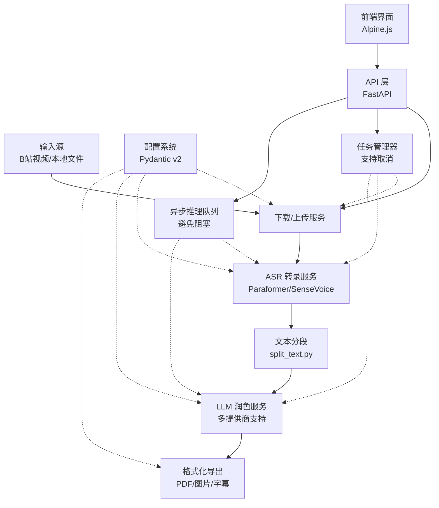
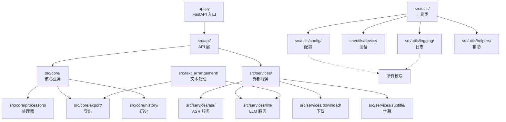

# CLAUDE.md

This file provides guidance to Claude Code (claude.ai/code) when working with code in this repository.

## 🚀 快速参考

### 最常用命令
```bash
# 开发
python api.py                           # 启动 Web + API（端口 8000）
pytest                                  # 运行测试
npm run dev                             # 前端开发（监听 CSS）

# Docker（推荐）
./scripts/docker-start.sh start         # 自动检测 GPU 并启动（Linux/Mac）
docker-start.bat start                  # Windows 版本
docker compose logs -f                  # 查看日志

# CLI 工具
python main.py                          # 交互式 CLI
python main.py single --bili URL        # 处理 B站视频
python main.py single --audio FILE      # 处理本地音频
```

### 关键文件
- `.env` - **必须配置**至少一个 LLM API Key
- `api.py` - FastAPI Web/API 服务入口
- `main.py` - CLI 命令行入口
- `src/utils/config/` - Pydantic v2 配置系统
- `src/core/processors/` - 核心处理器（音频/视频/字幕）
- `src/services/` - 外部服务集成（ASR/LLM/下载/字幕）
- `src/api/inference_queue.py` - 异步推理队列（解决 FastAPI 阻塞）

### 架构特点
- **模块化设计**: 遵循 SOLID 原则的模块化架构
- **处理流程**: 输入 → 下载/上传 → ASR 转录 → 文本分段 → LLM 润色 → 导出
- **任务取消**: 所有长时间操作都支持任务取消
- **异步推理**: 使用 `InferenceQueue` 避免 FastAPI 阻塞
- **多 LLM 支持**: DeepSeek、Gemini、Qwen、Cerebras、本地模型
- **设备自动检测**: 支持 CPU/GPU 自动切换

---

## 项目概述

AutoVoiceCollation 是一个 Python 音视频转文本系统，集成 ASR（FunASR）和 LLM（多提供商）进行识别、润色和导出。

**核心技术栈**: FunASR + PyTorch + FastAPI + frontend + 多 LLM 提供商

**处理流程**: 输入（B站/本地文件）→ 下载/上传 → ASR 识别 → LLM 润色 → 导出（PDF/图片/字幕）

### 架构图


## 关键命令

### 环境配置
```bash
# 初始化并配置环境变量（必须至少配置一个 LLM API Key）
cp .env.example .env

# 安装依赖（不包括 PyTorch）
pip install -r requirements.txt

# 安装 PyTorch（根据 CUDA 版本选择，参见 https://pytorch.org/）
pip install torch torchvision torchaudio --index-url https://download.pytorch.org/whl/cu129
```

### 运行服务

```bash
# CLI 模式
python main.py                      # 交互式
python main.py single --bili URL    # 处理 B站视频
python main.py single --audio FILE  # 处理本地音频
python main.py batch --url_file FILE # 批量处理

# Web 前端 + API（默认端口 8000）
python api.py
# 访问 API 文档: http://localhost:8000/docs
```

### Docker 部署

```bash
# 一键启动（自动检测 GPU/CPU）
./scripts/docker-start.sh start       # Linux/Mac
docker-start.bat start                # Windows

# 手动启动 - CPU 版本（推荐，无需 NVIDIA GPU）
docker compose --profile cpu-only build
docker compose --profile cpu-only up -d
# 访问: http://localhost:8001

# 手动启动 - GPU 版本（需要 nvidia-docker）
docker compose --profile gpu build
docker compose --profile gpu up -d
# 访问: http://localhost:8000

# 通用操作
docker compose logs -f            # 查看日志
docker compose down               # 停止服务
docker compose ps                 # 查看容器状态
```

### 测试
```bash
# 基本测试
pytest                                    # 运行所有测试
pytest -v                                 # 详细输出
pytest -s                                 # 显示打印输出（pytest.ini 已默认启用）

# 特定测试
pytest tests/test_api.py                  # 运行 API 测试
pytest tests/test_api.py::test_name -v   # 运行单个测试
pytest -k "test_pattern"                  # 运行匹配模式的测试

# 测试过滤
pytest -m "not slow and not integration"  # 跳过慢速/集成测试
pytest -m "unit"                          # 仅运行单元测试
pytest -m "integration"                   # 仅运行集成测试

# 测试调试
pytest --lf                               # 仅运行上次失败的测试
pytest --tb=short                         # 简短回溯信息

# 覆盖率
pytest --cov=src tests/                   # 测试覆盖率
pytest --cov=src --cov-report=html tests/ # 生成 HTML 覆盖率报告

# 注意：pytest.ini 已配置默认选项：
# -s (显示打印输出)
# --capture=no (不捕获输出)
# --tb=short (简短回溯)
# 标记：unit, integration, slow, asyncio
```

### 常用开发任务

```bash
python scripts/clear_output.py    # 清理输出和临时文件
tail -f logs/AutoVoiceCollation.log  # 查看日志

# Docker 网络故障排查（Windows 常见）
./test-mirrors.bat                # 测试镜像源速度
./diagnose-network.bat            # 网络诊断
./add-firewall-rule.bat           # 添加防火墙规则

# Docker 辅助脚本（Linux/Mac）
./scripts/docker-start.sh start       # 自动检测 GPU 并启动
./scripts/docker-start.sh start-cpu   # 强制 CPU 模式
./scripts/docker-start.sh logs        # 查看日志
./scripts/docker-start.sh clean       # 清理容器和镜像
./scripts/verify-font.sh              # 验证容器字体配置
./scripts/test-mirrors.sh             # 测试 Ubuntu 镜像源速度

# 前端开发
npm install                        # 安装前端依赖
npm run dev                       # 开发模式（监听 CSS 变化）
npm run build                     # 构建生产版本

# 代码质量检查
pytest --cov=src tests/           # 测试覆盖率
python -m mypy src/               # 类型检查（如果配置了 mypy）
```

## 核心架构

### 数据流处理管道

```
输入源 → 下载/上传 → ASR 转录 → 文本分段 → LLM 润色 → 格式化导出
  ↓          ↓          ↓         ↓         ↓          ↓
BiliURL   services/   services/ split_   services/   core/export/
或本地文件  download/   asr/      text.py  llm/        (PDF/图片/字幕)
         bilibili_              text_arrangement/
         downloader.py
```

### 重构后的模块化架构（v2）

项目已从扁平结构重构为模块化架构，遵循 SOLID 原则：

#### 模块依赖关系


#### 目录结构
```
src/
├── api/                    # API 层
│   ├── middleware/         # 中间件（错误处理等）
│   └── schemas/           # Pydantic 数据模型
├── core/                  # 核心业务逻辑
│   ├── exceptions/        # 异常定义
│   ├── export/           # 导出功能
│   ├── history/          # 处理历史
│   ├── models/           # 数据模型
│   └── processors/       # 处理器（音频/视频/字幕）
├── services/             # 外部服务集成
│   ├── asr/             # ASR 服务
│   ├── download/        # 下载服务（B站）
│   ├── llm/            # LLM 服务
│   └── subtitle/        # 字幕服务
├── text_arrangement/     # 文本处理
│   ├── polish_by_llm.py  # 文本润色
│   ├── query_llm.py      # LLM 接口
│   ├── split_text.py     # 文本分段
│   ├── summary_by_llm.py # 摘要生成
│   └── text_exporter.py  # 导出工具
├── utils/               # 工具类
│   ├── config/         # 配置管理（基于 Pydantic v2）
│   ├── device/         # 设备管理
│   ├── helpers/        # 辅助工具
│   └── logging/        # 日志系统
└── SenseVoiceSmall/    # SenseVoice 模型实现
```

**关键检查点**（任务取消）:
- 每个长时间运行的操作都必须传入 `task_id` 参数并在关键点检查取消
- `process_audio()` 在每个主要步骤前调用 `task_manager.should_stop(task_id)`
- `extract_audio_text()` 在模型加载前后都检查取消（`task_manager.check_cancellation(task_id)`）
- `polish_text()` 在处理每个文本段落前检查取消
- 捕获 `TaskCancelledException` 以清理资源

### 关键模块（重构后）

- **`src/utils/config/`**: 基于 Pydantic v2 的类型安全配置系统，支持环境变量验证和热重载
- **`src/core/processors/`**: 处理器基类和具体实现（音频/视频/字幕），遵循单一职责原则
- **`src/services/asr/`**: ASR 服务抽象层，支持 Paraformer 和 SenseVoice 模型，统一接口
- **`src/services/llm/`**: LLM 服务抽象层，支持多提供商（DeepSeek、Gemini、Qwen、Cerebras、本地模型）
- **`src/services/download/bilibili_downloader.py`**: B站视频下载服务，使用 yt-dlp，包含 `BiliVideoFile` 数据类
- **`src/services/subtitle/generator.py`**: 字幕生成服务，支持 SRT 格式和视频硬编码
- **`src/core/exceptions/`**: 统一的异常体系，按领域分类（ASR、LLM、下载、文件、任务等）
- **`src/utils/logging/`**: 结构化日志系统，支持彩色输出和日志级别控制
- **`src/utils/device/`**: 设备检测和管理，支持 CPU/GPU 自动检测和 ONNX Runtime 配置
- **`src/api/schemas/`**: Pydantic 数据模型，用于 API 请求/响应验证
- **`src/core/history/manager.py`**: 处理历史管理系统，支持 JSON 存储和检索
- **`src/api/inference_queue.py`**: 异步推理队列系统，解决 FastAPI 推理阻塞问题，支持单进程、单模型实例的异步推理

### 配置系统（src/utils/config/）

- **架构**: 基于 Pydantic v2 的类型安全配置系统，支持嵌套配置和自动验证
- **配置类**:
    - `AppConfig`: 主配置类，聚合所有子配置
    - `LLMConfig`: LLM 相关配置（API Keys、模型选择、参数）
    - `ASRConfig`: ASR 相关配置（模型选择、批处理大小、设备）
    - `PathConfig`: 路径配置（输出目录、缓存目录、模型目录）
    - `LoggingConfig`: 日志配置（级别、格式、输出文件）
- **关键配置**:
    - `ASR_MODEL`: `paraformer`（高精度）或 `sense_voice`（快速/多语言）
    - `LLM_SERVER`: 当前使用的 LLM 服务（支持：`deepseek-chat`, `gemini-2.0-flash`, `qwen3-plus`, `Cerebras:*`, `local:*`）
    - `ASYNC_FLAG`: 启用异步 LLM 润色（默认 `true`）
    - `DEVICE`: `auto`（自动检测 GPU）、`cpu`、`cuda:0` 等
    - `USE_ONNX`: 启用 ONNX Runtime 推理加速
    - `DISABLE_LLM_POLISH` / `DISABLE_LLM_SUMMARY`: 功能开关
- **使用方式**:
    ```python
    from src.utils.config import get_config
    config = get_config()
    print(config.llm.server)  # 访问 LLM 配置
    print(config.asr.model)   # 访问 ASR 配置
    ```

### API 架构（api.py）

- **任务存储**: 内存字典 `tasks = {task_id: {status, result, created_at, url, ...}}`
    - **注意**: 生产环境应使用持久化存储（如 Redis 或数据库）
- **核心端点**:
    - `POST /api/v1/process/bilibili` - 处理 B站视频（后台任务）
    - `POST /api/v1/process/audio` - 处理音频文件上传
    - `POST /api/v1/process/batch` - 批量处理 B站链接
    - `GET /api/v1/task/{task_id}` - 查询任务状态
    - `POST /api/v1/task/{task_id}/cancel` - 取消任务
    - `GET /api/v1/download/{task_id}` - 下载结果文件
- **异步处理**: 使用 FastAPI `BackgroundTasks` 启动后台任务

### 任务终止系统（src/utils/helpers/task_manager.py）

- **设计模式**: 单例模式，通过 `get_task_manager()` 获取全局实例
- **功能**:
    - 创建任务: `create_task(task_id)`
    - 请求停止: `stop_task(task_id)`
    - 检查取消: `check_cancellation(task_id)` - 抛出 `TaskCancelledException`
    - 查询状态: `should_stop(task_id)` - 返回布尔值
- **集成位置**:
    - `src/core/processors/`: 在下载、ASR、LLM、导出等步骤之间
    - `src/services/asr/`: 在模型加载前后、推理前
    - `src/text_arrangement/polish_by_llm.py`: 在处理每个文本段落前（同步和异步模式）
- **异常处理**: 所有处理流程都应捕获 `TaskCancelledException` 以优雅地终止任务
- **关键实现细节**:
    - 长时间运行的操作（如模型加载）后必须再次检查取消
    - 在循环中处理批量数据时，每次迭代前都应检查取消
    - 异步处理中，在 `await` 操作前检查取消

### LLM 集成策略（src/services/llm/）

- **架构**: 工厂模式 + 策略模式，统一 LLM 服务接口
- **支持的服务**:
    - DeepSeek (`deepseek-chat`, `deepseek-reasoner`)
    - Gemini (`gemini-2.0-flash`)
    - Qwen/通义千问 (`qwen3-plus`, `qwen3-max`)
    - Cerebras (`Cerebras:Qwen-3-32B`, `Cerebras:Qwen-3-235B-Instruct`)
    - 本地模型 (`local:Qwen/Qwen2.5-1.5B-Instruct`)
- **核心组件**:
    - `factory.py`: LLM 工厂，根据配置创建对应的 LLM 服务实例
    - `base.py`: 抽象基类，定义统一的 LLM 接口
    - 具体实现: `deepseek.py`, `gemini.py`, `qwen.py`, `cerebras.py`, `local.py`
- **异步处理**:
    - `polish_by_llm.py` 使用 `asyncio.gather()` 并发调用多个 LLM API
    - 速率限制: `RateLimiter` 类（默认 10 req/min）
    - 重试机制: 最多 3 次重试，指数退避 30 秒
- **文本分段**: `split_text.py` 按 `SPLIT_LIMIT` 切分长文本（默认 6000 字符）

### 字幕生成系统（src/services/subtitle/generator.py）

- **核心流程**:
    1. ASR 时间戳识别（SenseVoice 或 Paraformer 的时间戳模式）
    2. 文本智能分段（基于停顿阈值 `pause_threshold` 和最大字符数）
    3. LLM 文本匹配和优化（将润色后的文本映射到时间戳）
    4. SRT 字幕生成和视频硬编码（通过 FFmpeg）
- **配置类**: `SubtitleConfig` - 可调节停顿阈值、字符限制、LLM 参数等
- **关键函数**:
    - `generate_subtitle_file()` - 生成 SRT 字幕文件
    - `encode_subtitle_to_video()` - 将字幕烧录到视频

### 设备管理（src/utils/device/）

- **自动检测**: `detect_device(device_config)` 支持 `"auto"`, `"cpu"`, `"cuda"`, `"cuda:0"` 等
- **ONNX Runtime**:
    - `get_onnx_providers(device, custom_providers)` - 根据设备自动选择 ONNX 执行提供者
    - 支持自定义提供者配置（通过 `.env` 的 `ONNX_PROVIDERS`）
- **调试工具**: `print_device_info()` - 打印 PyTorch/CUDA/ONNX Runtime 版本信息

### 前端架构（frontend/）

- **技术栈**: Alpine.js + Tailwind CSS
- **构建工具**: npm + Tailwind CLI
- **主题系统**:
    - `theme.js` - 支持亮色/暗色/跟随系统三种主题
    - 使用 `localStorage` 持久化主题设置
    - 避免页面加载闪烁（FOUC）
- **状态管理**:
    - `main.js` 使用 Alpine.js 的 `Alpine.data()` 管理全局状态
    - 实时任务轮询（每 2 秒刷新任务列表）
    - 支持任务取消和文件下载
- **关键组件**:
    - B站视频处理表单
    - 本地文件上传表单
    - 批量处理表单
    - 字幕生成表单
    - 任务状态展示和管理
- **样式**:
    - `frontend/src/css/input.css` - Tailwind 输入文件
    - `frontend/dist/css/output.css` - 编译后的 CSS（生产环境）
    - 支持暗色模式（通过 Tailwind 的 `dark:` 前缀）
- **开发命令**:
    ```bash
    npm run dev           # 监听 CSS 变化，自动重新编译
    npm run build         # 构建生产版本（压缩）
    ```

### 输出文件结构

处理完成后，输出目录结构如下（以 `out/video_name/` 为例）：

```
out/video_name/
├── video_info.txt              # 视频元数据（标题、UP主、时长等）
├── audio_transcription.txt     # ASR 原始转录文本
├── polish_text.txt             # LLM 润色后的文本
├── summary_text.md             # 内容摘要（如启用）
├── output.pdf                  # 最终 PDF 输出（根据 OUTPUT_STYLE 配置）
├── output_images/              # 图片输出（如启用）
│   ├── page_1.png
│   └── ...
├── subtitle.srt                # 字幕文件（如生成）
���── video_with_subtitle.mp4     # 带字幕视频（如生成）
```

**配置控制** (`.env`):
- `OUTPUT_STYLE`: `pdf_only`, `pdf_with_img`, `img_only`, `text_only`
- `ZIP_OUTPUT_ENABLED`: 是否自动打包为 ZIP

## 开发规范

### 代码风格

- **命名**: 函数 `snake_case`，类 `PascalCase`，常量 `UPPER_CASE`
- **类型提示**: 推荐使用类型注解，参考 `query_llm.py` 中的 `LLMQueryParams` dataclass
- **日志**:
  ```python
  from src.utils.logging.logger import get_logger
  logger = get_logger(__name__)

  logger.debug("详细调试信息")
  logger.info("一般流程信息")
  logger.error("错误信息", exc_info=True)  # 包含堆栈跟踪
  ```
  - 日志配置通过 `.env` 文件管理（`LOG_LEVEL`, `LOG_FILE`, `LOG_CONSOLE_OUTPUT` 等）
  - 支持彩色控制台输出（可通过 `LOG_COLORED_OUTPUT` 关闭）
  - 第三方库日志级别可独立配置（`THIRD_PARTY_LOG_LEVEL`）
- **异常处理**:
    - 始终捕获异常并记录详细日志
    - 使用 `TaskCancelledException` 处理任务取消
    - 在 API 端点中返回合适的 HTTP 状态码
- **注释语言**: 与现有代码库保持一致（主要为中文）
- **文档字符串**: 函数/类应包含 docstring，说明参数、返回值和可能的异常

### 代码示例

#### 1. 使用配置系统
```python
from src.utils.config import get_config

# 获取全局配置
config = get_config()

# 访问配置项
llm_server = config.llm.server  # 如: "deepseek-chat"
asr_model = config.asr.model    # 如: "paraformer"
device = config.device          # 如: "auto"

# 检查功能开关
if not config.llm.disable_polish:
    # 执行 LLM 润色
    pass
```

#### 2. 支持任务取消的函数
```python
from typing import Optional
from src.utils.helpers.task_manager import get_task_manager, TaskCancelledException

task_manager = get_task_manager()

def process_with_cancellation(data: str, task_id: Optional[str] = None) -> str:
    """支持任务取消的处理函数"""
    try:
        # 检查点 1: 操作前
        if task_id:
            task_manager.check_cancellation(task_id)

        # 长时间操作
        result = heavy_processing(data)

        # 检查点 2: 操作后
        if task_id:
            task_manager.check_cancellation(task_id)

        return result
    except TaskCancelledException:
        logger.info(f"任务 {task_id} 被取消")
        raise
    finally:
        # 清理资源
        if task_id:
            task_manager.remove_task(task_id)
```

#### 3. 使用 LLM 服务
```python
from src.services.llm.factory import create_llm_service

# 创建 LLM 服务实例（根据配置自动选择）
llm_service = create_llm_service()

# 调用 LLM
response = await llm_service.generate(
    prompt="请润色以下文本: ...",
    temperature=0.1,
    max_tokens=1000
)
```

#### 4. API 端点示例
```python
from fastapi import APIRouter, BackgroundTasks
from src.api.schemas.task import TaskResponse
from src.core.processors.audio import AudioProcessor

router = APIRouter()

@router.post("/process/audio", response_model=TaskResponse)
async def process_audio(
    file_url: str,
    background_tasks: BackgroundTasks
):
    """处理音频文件"""
    task_id = str(uuid.uuid4())

    # 创建处理器实例
    processor = AudioProcessor()

    # 在后台执行任务
    background_tasks.add_task(
        processor.process,
        file_url=file_url,
        task_id=task_id
    )

    return TaskResponse(
        task_id=task_id,
        status="processing",
        message="任务已开始处理"
    )
```

### 添加新 LLM 服务

1. 在 `src/utils/config/llm.py` 中：
    - 在 `LLMConfig` 中添加新的配置字段
    - 更新 `LLM_SERVER_SUPPORTED` 列表
2. 在 `src/services/llm/` 中：
    - 创建新的 LLM 服务类（如 `new_llm.py`），继承自 `BaseLLMService`
    - 实现 `async def generate(self, prompt: str, **kwargs) -> str` 方法
    - 在 `factory.py` 的 `create_llm_service()` 函数中添加新的分支
3. 更新 `.env.example` 和相关文档

### 实现任务取消支持

**原则**: 所有长时间运行的操作都必须支持任务取消

**步骤**:

1. **函数签名**: 添加可选的 `task_id: Optional[str] = None` 参数
2. **检查点设置**: 在以下位置检查取消：
   - 长时间操作**前**（如模型加载前）
   - 长时间操作**后**（如模型加载后、推理前）
   - 循环中每次迭代前
   - 异步操作前
3. **异常传播**: 捕获 `TaskCancelledException` 后向上传播，不要吞掉异常
4. **资源清理**: 在 `finally` 块中调用 `task_manager.remove_task(task_id)`

**示例**:
```python
from typing import Optional
from src.utils.helpers.task_manager import get_task_manager, TaskCancelledException

task_manager = get_task_manager()

def long_running_function(input_data: str, task_id: Optional[str] = None) -> str:
    """支持任务取消的长时间运行函数"""
    try:
        # 检查点 1: 操作前
        if task_id:
            task_manager.check_cancellation(task_id)

        # 长时间操作（如加载模型）
        model = load_heavy_model()

        # 检查点 2: 长时间操作后
        if task_id:
            task_manager.check_cancellation(task_id)

        # 批量处理
        for item in data_items:
            # 检查点 3: 循环中
            if task_id:
                task_manager.check_cancellation(task_id)
            process_item(item)

        return result
    except TaskCancelledException:
        # 向上传播取消异常
        raise
    finally:
        # 清理任务
        if task_id:
            task_manager.remove_task(task_id)
```

### 测试编写

- **测试标记**:
    - `@pytest.mark.unit` - 单元测试（默认）
    - `@pytest.mark.integration` - 集成测试（需要外部服务）
    - `@pytest.mark.slow` - 慢速测试
    - `@pytest.mark.asyncio` - 异步测试
- **Fixture**: 常用 fixture 在 `tests/conftest.py`（包括 mock API 客户端、临时目录等）
- **Mock 策略**:
    - `conftest.py` 自动 mock 重型依赖（torch, funasr, transformers）
    - 使用 `RecursiveMock` 类实现递归 mock，模拟嵌套模块结构
    - 使用 `pytest-mock` 或 `responses` 库 mock 外部 API
    - LLM API mock 返回固定响应（避免真实 API 调用）
- **环境隔离**:
    - 测试使用独立的临时目录（`/tmp/autovoicecollation_test_*`）
    - `conftest.py` 在导入前设置环境变量，确保配置正确加载
    - 自动配置测试用的 API Keys（`test_*_key`）
- **字体处理**: 测试环境自动创建 fake 字体文件（`tests/fake_font.ttf`）避免 PDF 生成错误

## 常见问题处理

### Docker 网络问题（Windows 常见）

**症状**: `Connection failed`, `502 Bad Gateway`, 或容器无法访问外网

**排查步骤**:

1. 运行 `./diagnose-network.bat` 诊断网络
2. 检查防火墙: `./add-firewall-rule.bat` 添加 Docker 规则
3. 测试镜像源: `./test-mirrors.bat`
4. 重启 Docker Desktop: `./restart-docker-fix.bat`

**解决方案**:

- 修改 `Dockerfile` 第 21-22 行切换 pip 镜像源（清华/阿里云/中科大）
- 设置代理: `.env` 中配置 `HTTP_PROXY` 和 `HTTPS_PROXY`
- 详见 `docs/deployment/docker/troubleshooting-network.md`（统一网络问题解决方案）

### GPU 内存不足（CUDA OOM）

**解决方案**:

- 降低 batch size: 修改 `src/extract_audio_text.py` 中的 `batch_size_s` 参数
- 切换轻量模型: `.env` 设置 `ASR_MODEL=sense_voice`
- 启用 ONNX 加速: `USE_ONNX=true`（需先安装 `onnxruntime-gpu`）
- 强制使用 CPU: `DEVICE=cpu`

### FunASR 模型下载慢

**解决方案**:

- 设置本地缓存: `.env` 中 `MODEL_DIR=./models`
- 使用镜像源: 设置环境变量 `MODELSCOPE_CACHE=/path/to/cache`
- 手动下载模型到 `MODEL_DIR` 目录

### Docker 容器崩溃（字体问题）

**症状**: 容器启动后崩溃或 PDF 生成失败

**解决方案**:

1. 检查字体是否安装: `docker exec avc-api ls /usr/share/fonts/truetype/wqy/`
2. 运行字体验证脚本: `docker exec avc-api ./scripts/verify-font.sh`
3. 详见 `docs/deployment/docker/troubleshooting-font.md`

### 测试失败排查

1. 检查 `.env` 配置（至少一个 LLM API Key）
2. 查看详细输出: `pytest -v -s`
3. 仅运行失败测试: `pytest --lf`
4. 检查日志: `logs/AutoVoiceCollation.log`
5. CI 环境: 确保 `tests/conftest.py` 中的 mock 配置正确

### 任务无法取消

**症状**: 点击前端的"终止任务"按钮后任务继续运行

**排查步骤**:

1. 检查日志中是否有 `Task stop requested: {task_id}` 消息
2. 查看任务是否在长时间操作中（如模型加载、ASR 推理、LLM 调用）
3. 确认相关函数是否传入了 `task_id` 参数
4. 检查是否使用了新的处理器架构（`src/core/processors/`）

**常见原因**:

- 函数未传入 `task_id` 参数
- 长时间操作后缺少取消检查点
- 捕获了 `TaskCancelledException` 但未向上传播
- 使用了旧的模块而非新的处理器架构

**解决方案**: 参考"实现任务取消支持"章节，确保使用新的处理器架构

## 重要约定

- **不提交敏感文件**: `.env` 已在 `.gitignore`（包含 API Keys）
- **输出目录**: `out/`, `download/`, `temp/`, `logs/` 不提交（gitignored）
- **模型缓存**: 默认使用 `~/.cache/modelscope`，可通过 `MODEL_DIR` 覆盖
- **端口配置**:
    - Web/API: 8000（默认）
    - Docker CPU 版本: 8001
- **Python 版本**: 3.11+（兼容 PyTorch 2.x 和 FunASR）
- **外部依赖**: FFmpeg（系统级）、中文字体（Linux 需安装 `fonts-wqy-zenhei`）、yt-dlp（B站下载）
- **Docker 配置**:
    - 支持 GPU 和 CPU 两种 profile（通过 `docker compose --profile` 选择）
    - 默认资源限制：最大 8GB 内存，预留 4GB
    - 卷挂载持久化：`out/`, `download/`, `temp/`, `logs/`, `models/`
    - 重启策略：`unless-stopped`

---

## 架构演进状态

### ✅ 已实现的改进

#### 1. 模块重构（已完成）
项目已从扁平结构重构为模块化架构，遵循 SOLID 原则：
- **core/**: 核心业务逻辑（处理器、模型、异常、导出、历史）
- **services/**: 外部服务集成（ASR、LLM、下载、字幕）
- **utils/**: 工具类（配置、设备、日志、辅助工具）
- **api/**: API 层（中间件、数据模型）

#### 2. 配置管理增强（已完成）
- 使用 Pydantic v2 进行类型安全配置验证
- 支持嵌套配置和自动环境变量加载
- 配置热重载支持

#### 3. 错误处理统一（已完成）
- 创建统一的异常体系（`src/core/exceptions/`）
- 按领域分类异常（ASR、LLM、下载、文件、任务等）
- API 错误处理中间件（`src/api/middleware/error_handler.py`）

#### 4. 测试优化（进行中）
- 集成测试覆盖率提升
- 使用 pytest 标记系统（unit、integration、slow、asyncio）
- 自动 mock 重型依赖（torch、funasr、transformers）
- 新增异步推理队列测试（`tests/test_async_queue.py`）

#### 5. 异步推理队列（已完成）
- 引入 `InferenceQueue` 系统，解决 FastAPI 推理阻塞问题
- 支持单进程、单模型实例的异步推理
- 串行处理任务，避免 GPU 冲突
- 队列容量限制（50个任务），避免积压

### 🔄 待实现的改进

#### 1. 监控和可观测性
- 添加 Prometheus 指标
- 集成结构化日志（JSON 格式）
- 添加分布式追踪支持

#### 2. 前端现代化
- 考虑使用现代前端框架（Vue.js/React）
- 添加状态管理
- 优化构建流程和代码分割

#### 3. 任务存储持久化
- 当前使用内存字典存储任务状态
- 建议添加 Redis 或数据库支持
- 支持任务状态恢复和持久化

#### 4. 性能优化
- 添加缓存层（模型缓存、结果缓存）
- 支持流式处理和增量处理
- 优化内存使用和 GPU 利用率

## 从旧架构迁移

项目已从扁平结构（v1）重构为模块化架构（v2）。主要变化：

### 已删除的旧模块
- `src/config.py` → 迁移到 `src/utils/config/`
- `src/core_process.py` → 迁移到 `src/core/processors/`
- `src/extract_audio_text.py` → 迁移到 `src/services/asr/`
- `src/subtitle_generator.py` → 迁移到 `src/services/subtitle/`
- `src/task_manager.py` → 迁移到 `src/utils/helpers/task_manager.py`
- `src/device_manager.py` → 迁移到 `src/utils/device/`
- `src/logger.py` → 迁移到 `src/utils/logging/`

### 新增模块
- **`src/api/inference_queue.py`**: 异步推理队列系统，解决 FastAPI 推理阻塞问题
- **`tests/test_async_queue.py`**: 异步推理队列测试

### 新架构优势
1. **单一职责**: 每个模块/类有明确的职责
2. **依赖倒置**: 高层模块不依赖低层模块，都依赖抽象
3. **开闭原则**: 易于扩展新功能（如添加新的 LLM 服务）
4. **接口隔离**: 细粒度的接口设计
5. **依赖注入**: 通过配置和工厂模式管理依赖

### 迁移指南
1. 更新导入语句，使用新的模块路径
2. 使用新的配置系统（`from src.utils.config import get_config`）
3. 使用新的处理器架构（`src/core/processors/`）
4. 使用新的服务抽象层（`src/services/`）

## 📚 完整文档系统

> **文档中心**: 完整的文档导航和组织结构请查看 [docs/README.md](docs/README.md)

**快速访问**:
- **开发文档**: [docs/development/developer-guide.md](docs/development/developer-guide.md) - 环境配置、编码规范、贡献流程
- **API 文档**: [docs/user-guide/api-usage.md](docs/user-guide/api-usage.md) - RESTful API 端点和使用示例
- **Docker 文档**: [docs/deployment/docker.md](docs/deployment/docker.md) - 完整的 Docker 部署说明

**更多文档**:
- **架构设计**: [异常处理](docs/architecture/exception-handling.md) | [处理历史](docs/architecture/process-history.md)
- **故障排查**: [网络问题](docs/deployment/docker/troubleshooting-network.md) | [字体问题](docs/deployment/docker/troubleshooting-font.md) | [容器崩溃](docs/deployment/docker/troubleshooting-crash.md)
- **项目规划**: [路线图](docs/proposals/ROADMAP.md) | [开发改进建议](docs/proposals/dev-suggestions.md)

---

## 关于此 CLAUDE.md 文件

此文件为 Claude Code 提供在 AutoVoiceCollation 项目中工作的指导。它包含了：

### 🎯 核心目标
1. **快速上手**: 提供最常用的命令和关键文件位置
2. **架构理解**: 通过图表和说明帮助理解项目架构
3. **开发指南**: 提供代码示例和最佳实践
4. **故障排查**: 常见问题的解决方案

### 📋 使用建议
- **新开发者**: 从"快速参考"和"关键命令"开始
- **架构理解**: 查看"架构图"和"模块依赖关系"
- **代码开发**: 参考"代码示例"和"开发规范"
- **问题解决**: 查看"常见问题处理"

### 🔄 更新维护
此文件应与项目代码同步更新。当添加新功能或修改架构时，请相应更新：
1. 命令和配置变化
2. 架构图更新
3. 新的代码示例
4. 常见问题解决方案

### 🎨 可视化特色
- **Mermaid 图表**: 提供直观的架构和依赖关系图
- **代码示例**: 展示关键功能的实现方式
- **结构化信息**: 层次清晰，便于查找

> **提示**: 此文件是现有详细文档的补充，完整文档请查看 `docs/` 目录。
