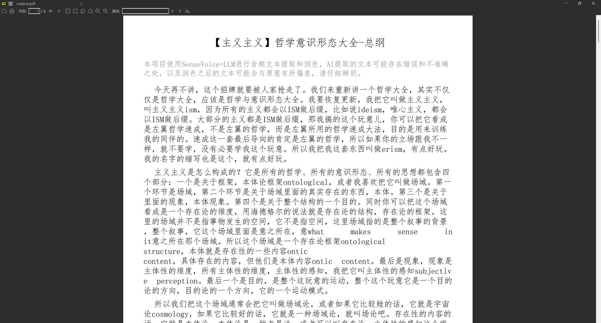
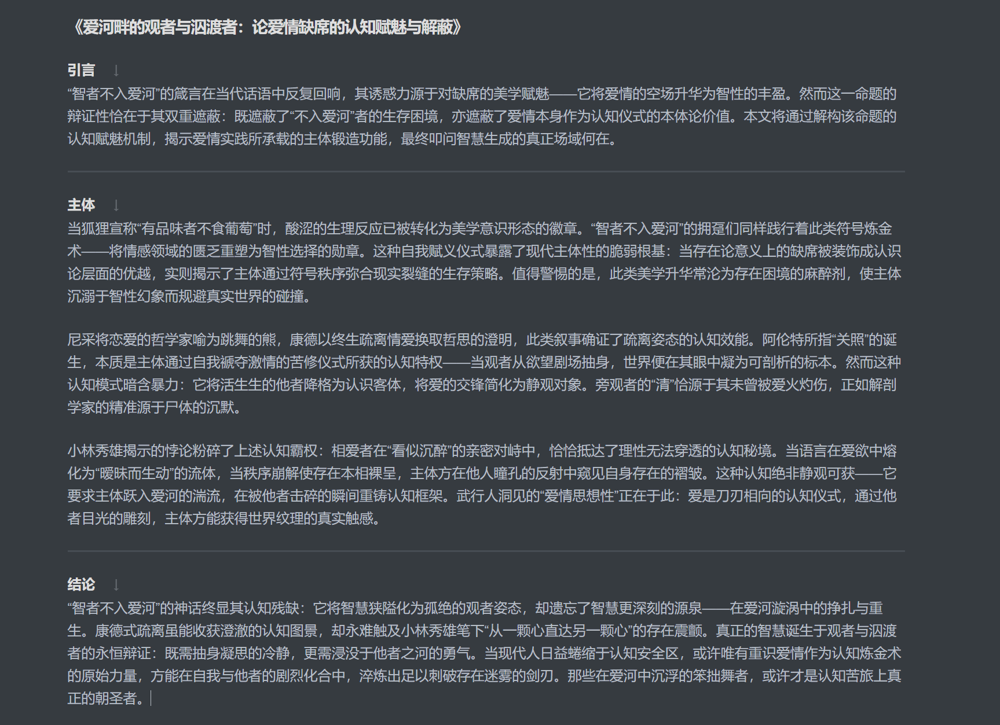

# AutoVoiceCollation

<div align="center">
  
</div>

自动语音识别与智能文本整理工具，结合 ASR 和 LLM 技术，一键将音视频转换为精美文档。

## 核心功能

- **多源输入**: B站视频 / 本地音视频文件（mp3, wav, m4a, flac, mp4）
- **高精度识别**: 支持 SenseVoice 和 Paraformer 模型
- **智能润色**: 集成 DeepSeek、Qwen、Gemini、Cerebras 等 LLM
- **多格式输出**: PDF / 图片 / 文本 / SRT 字幕
- **三种使用方式**: CLI / Web 前端 / RESTful API

> **性能提示**: 推荐使用 GPU 加速。详细开发文档请参考 [docs/development/developer-guide.md](docs/development/developer-guide.md)

## 快速开始

### 🐳 Docker 部署（推荐）

**最简单的方式 - 一键启动：**

```bash
# 1. 克隆项目
git clone https://github.com/LogicShao/AutoVoiceCollation
cd AutoVoiceCollation

# 2. 配置环境变量
cp .env.example .env
# 编辑 .env 文件，填入至少一个 LLM API Key

# 3. 启动服务（自动检测 GPU）
# Linux/Mac:
./docker-start.sh start

# Windows:
docker-start.bat start

# 访问 Web: http://localhost:8000
```

> 📚 **详细的 Docker 部署文档请查看**: [DOCKER.md](docs/deployment/docker.md)

### 💻 本地安装

```bash
# 1. 克隆并进入项目
git clone https://github.com/LogicShao/AutoVoiceCollation
cd AutoVoiceCollation

# 2. 创建虚拟环境
conda create -n avc_env python=3.11 -y
conda activate avc_env

# 3. 安装依赖
pip install -r requirements.txt
# 安装 PyTorch (CUDA): 访问 https://pytorch.org/ 获取适合你系统的命令
pip install torch torchvision torchaudio --index-url https://download.pytorch.org/whl/cu129

# 4. 配置环境变量
cp .env.example .env  # Linux/Mac
copy .env.example .env  # Windows
# 编辑 .env 文件，填入至少一个 LLM API Key
```

## 使用方式

### CLI 命令行

```bash
# 交互式模式
python main.py

# 处理 B站视频
python main.py single --bili https://www.bilibili.com/video/BV1...

# 处理本地音频
python main.py single --audio /path/to/audio.mp3

# 批量处理
python main.py batch --url_file urls.txt

# 添加字幕
python main.py subtitle --video /path/to/video.mp4
```

### Web 界面

```bash
python api.py
# 浏览器访问自动打开的地址（默认端口在 .env 中配置）
```

### API 服务

```bash
# 启动 API 服务
python api.py

# 访问 API 文档: http://localhost:8000/docs
```

**主要端点**:
- `POST /api/v1/process/bilibili` - 处理 B站视频
- `POST /api/v1/process/audio` - 处理音频文件
- `GET /api/v1/task/{task_id}` - 查询任务状态
- 更多详见 [API 文档](docs/user-guide/api-usage.md)

## 配置说明

主要配置项（在 `.env` 文件中设置）：

```bash
# ASR 模型：sense_voice 或 paraformer
ASR_MODEL=paraformer

# LLM 服务（需配置对应的 API Key）
LLM_SERVER=Cerebras:Qwen-3-235B-Instruct
LLM_TEMPERATURE=0.1
LLM_MAX_TOKENS=6000

# 输出格式：pdf_with_img, img_only, text_only, pdf_only, markdown, json
OUTPUT_STYLE=pdf_only

# 功能开关
DISABLE_LLM_POLISH=false  # 禁用文本润色
DISABLE_LLM_SUMMARY=false  # 禁用摘要生成
```

**支持的 LLM 服务**:

- `gemini-2.0-flash` (需 GEMINI_API_KEY)
- `deepseek-chat` (需 DEEPSEEK_API_KEY)
- `qwen3-plus` / `qwen3-max` (需 DASHSCOPE_API_KEY)
- `Cerebras:Qwen-3-235B-Instruct` (需 CEREBRAS_API_KEY)
- `local:Qwen/Qwen2.5-1.5B-Instruct` (本地模型)

完整配置说明请查看 `.env.example` 文件。

## Demo 展示

<details>
<summary>点击展开查看演示截图</summary>


**PDF 输出效果**:


**摘要生成**:


</details>

## 项目结构

```
AutoVoiceCollation/
├── main.py              # CLI 入口
├── api.py               # Web/API 服务入口
├── config.py            # 配置管理
├── src/
│   ├── bilibili_downloader.py    # B站下载
│   ├── extract_audio_text.py     # ASR 识别
│   ├── core_process.py            # 核心流程
│   ├── subtitle_generator.py     # 字幕生成
│   └── text_arrangement/          # 文本处理
│       ├── query_llm.py           # LLM 接口
│       ├── polish_by_llm.py       # 文本润色
│       ├── summary_by_llm.py      # 摘要生成
│       └── text_exporter.py       # 导出工具
└── .env.example         # 配置模板
```

详细架构说明请参考 [docs/development/developer-guide.md](docs/development/developer-guide.md)

## 常见问题

**Q: 如何选择 ASR 模型？**

- `paraformer`: 准确度高，适合中文（需要更多显存）
- `sense_voice`: 速度快，支持多语言

**Q: 显存不足怎么办？**

- 使用 SenseVoice 模型或降低 `batch_size_s` 参数（在 `src/extract_audio_text.py`）

**Q: 如何使用本地 LLM？**

```bash
# 在 .env 中设置
LOCAL_LLM_ENABLED=true
LLM_SERVER=local:Qwen/Qwen2.5-1.5B-Instruct
```

**Q: 如何使用 Docker 部署？**

推荐使用 Docker 部署，可避免环境配置问题：

```bash
# 快速启动（自动检测 GPU）
./docker-start.sh start        # Linux/Mac
docker-start.bat start         # Windows

# 仅使用 CPU
./docker-start.sh start-cpu    # Linux/Mac
docker-start.bat start-cpu     # Windows
```

详细说明请查看 [DOCKER.md](docs/deployment/docker.md)

**Q: API 服务如何部署？**
```bash
# 直接运行
python api.py

# 或使用 uvicorn 指定参数
uvicorn api:app --host 0.0.0.0 --port 8000

# Docker 部署
docker compose up -d
```

更多问题请查看 [Issues](https://github.com/LogicShao/AutoVoiceCollation/issues) 或提交新 Issue。

## 贡献与支持

欢迎提交 Issue 和 Pull Request！开发文档请参考 [docs/development/developer-guide.md](docs/development/developer-guide.md)

## 许可证

MIT License

## 致谢

- [FunASR](https://github.com/alibaba-damo-academy/FunASR) - 语音识别引擎
- [yt-dlp](https://github.com/yt-dlp/yt-dlp) - 视频下载工具
- [FastAPI](https://fastapi.tiangolo.com/) - API 框架

---

**如需详细技术文档、架构说明或开发指南，请查看 [docs/development/developer-guide.md](docs/development/developer-guide.md)**
