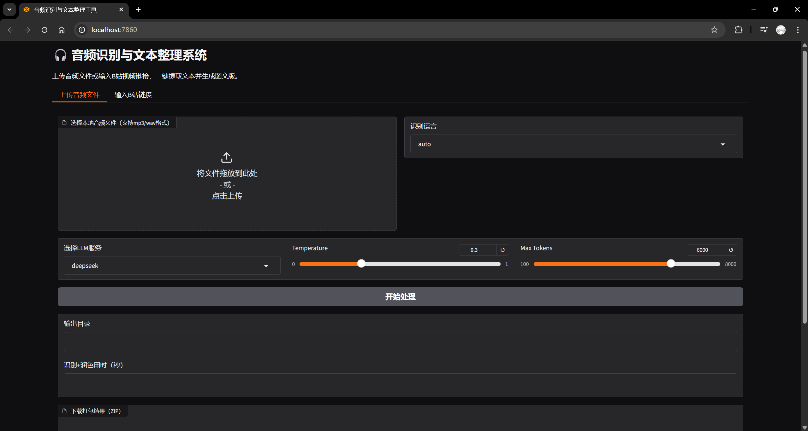

# AutoVoiceCollation

<div align="center">
  
</div>

## 介绍

AutoVoiceCollation 是一个功能强大的自动语音识别（ASR）和文本处理工具，旨在帮助用户快速整理和润色语音转录文本。

### 核心功能

- **多源输入支持**：
  - B站视频自动下载与识别
  - 本地音频文件识别（mp3/wav/m4a/flac）
  - 本地视频文件音频提取与识别

- **高精度语音识别**：
  - 支持 SenseVoiceSmall 模型
  - 支持 Paraformer 模型

- **智能文本处理**：
  - LLM 自动润色（支持 DeepSeek、Qwen、Gemini、Cerebras、本地模型）
  - LLM 文本摘要生成
  - 异步批处理提升效率

- **多格式输出**：
  - 文本文件（.txt）
  - PDF 文档（支持图文混排）
  - 图片格式
  - 字幕文件（.srt）

- **字幕功能**：
  - 一键生成字幕文件（.srt）
  - 视频字幕硬编码

- **灵活使用方式**：
  - 命令行界面（CLI）
  - Web 图形界面（Gradio）
  - RESTful API 服务（FastAPI）

### 性能建议

推荐使用带有 CUDA 的 GPU 运行本项目。如果遇到显存不足或需要提升性能，可修改 `src/extract_audio_text.py` 中的 `batch_size_s` 参数。

## Quick Start

* **第一步：克隆代码**

```bash
git clone https://github.com/LogicShao/AutoVoiceCollation
cd AutoVoiceCollation
```

* **第二步：创建并激活虚拟环境**

```bash
conda create -n avc_env python=3.11 -y
```

* **第三步：安装依赖**

```bash
# 1. 安装基础依赖
pip install -r requirements.txt

# 2. 安装 PyTorch（推荐使用 CUDA 版本）
# 访问 PyTorch 官网 https://pytorch.org/ 获取适合你系统的命令
# CUDA 12.9 示例:
pip install torch torchvision torchaudio --index-url https://download.pytorch.org/whl/cu129
```

* **第四步：配置环境变量**

复制 `.env.example` 为 `.env`，并填入你的 API 密钥：

```bash
# Linux/Mac
cp .env.example .env
# Windows
copy .env.example .env
```

编辑 `.env` 文件，填入必要的配置（参考下方"配置说明"）。

## 使用方式

### 方式一：命令行界面（CLI）

#### 1. 交互式模式

直接运行主程序，按提示输入 B站视频链接：

```bash
python main.py
```

#### 2. 单文件处理

```bash
# 处理本地音频文件
python main.py single --audio /path/to/audio.mp3

# 处理本地视频文件
python main.py single --video /path/to/video.mp4

# 处理B站视频
python main.py single --bili https://www.bilibili.com/video/BV1...
```

#### 3. 批量处理 B站视频

```bash
python main.py batch --url_file urls.txt
```

`urls.txt` 格式（每行一个链接）：
```
https://www.bilibili.com/video/BV1...
https://www.bilibili.com/video/BV2...
```

#### 4. 添加字幕

```bash
python main.py subtitle --video /path/to/video.mp4
```

### 方式二：Web 图形界面

启动 Gradio Web 界面：

```bash
python webui.py
```

浏览器会自动打开 `http://localhost:端口号`（端口号在 `.env` 中的 `WEB_SERVER_PORT` 配置）。

Web 界面提供以下功能：
- 输入 B站链接
- 批量处理 B站链接
- 上传本地音频文件
- 上传本地视频文件
- 自动添加字幕

### 方式三：API 服务

#### 启动 API 服务

```bash
python api.py
```

API 服务默认运行在 `http://0.0.0.0:8000`。

#### API 端点

访问 `http://localhost:8000/docs` 查看完整的 API 文档（Swagger UI）。

主要端点：
- `GET /` - API 信息
- `GET /health` - 健康检查
- `POST /api/v1/process/bilibili` - 处理 B站视频
- `POST /api/v1/process/audio` - 处理音频文件
- `POST /api/v1/process/batch` - 批量处理
- `POST /api/v1/process/subtitle` - 生成字幕
- `GET /api/v1/task/{task_id}` - 查询任务状态
- `GET /api/v1/download/{task_id}` - 下载处理结果

#### API 使用示例

**处理 B站视频：**

```bash
curl -X POST "http://localhost:8000/api/v1/process/bilibili" \
  -H "Content-Type: application/json" \
  -d '{
    "video_url": "https://www.bilibili.com/video/BV1...",
    "llm_api": "deepseek-chat",
    "temperature": 0.1,
    "max_tokens": 6000
  }'
```

返回示例：
```json
{
  "task_id": "550e8400-e29b-41d4-a716-446655440000",
  "status": "pending",
  "message": "任务已提交，正在处理中"
}
```

**查询任务状态：**

```bash
curl "http://localhost:8000/api/v1/task/550e8400-e29b-41d4-a716-446655440000"
```

**下载结果：**

```bash
curl -O "http://localhost:8000/api/v1/download/550e8400-e29b-41d4-a716-446655440000"
```

## 配置说明

项目通过 `.env` 文件进行配置。请参考 `.env.example` 文件中的详细说明。

### 必需配置

根据使用的 LLM 服务，至少配置一个 API Key：

```dotenv
# DeepSeek API Key
DEEPSEEK_API_KEY=your_deepseek_api_key

# Google Gemini API Key
GEMINI_API_KEY=your_gemini_api_key

# 阿里云 DashScope API Key（用于通义千问）
DASHSCOPE_API_KEY=your_dashscope_api_key

# Cerebras API Key
CEREBRAS_API_KEY=your_cerebras_api_key
```

### 主要配置项

#### ASR 模型选择

```dotenv
# 可选：sense_voice 或 paraformer
ASR_MODEL=paraformer
```

#### LLM 服务选择

```dotenv
# 可选值：
# - gemini-2.0-flash
# - deepseek-chat
# - deepseek-reasoner
# - qwen3-max
# - qwen3-plus
# - Cerebras:Qwen-3-32B
# - Cerebras:Qwen-3-235B-Instruct
# - Cerebras:Qwen-3-235B-Thinking
# - local:Qwen/Qwen2.5-1.5B-Instruct
LLM_SERVER=Cerebras:Qwen-3-235B-Instruct
LLM_TEMPERATURE=0.1
LLM_MAX_TOKENS=6000
```

#### 输出格式

```dotenv
# 可选：pdf_with_img, img_only, text_only, pdf_only
OUTPUT_STYLE=pdf_only

# 是否输出 zip 压缩包
ZIP_OUTPUT_ENABLED=false
```

#### 功能开关

```dotenv
# 是否禁用 LLM 润色
DISABLE_LLM_POLISH=false

# 是否禁用 LLM 摘要
DISABLE_LLM_SUMMARY=false

# 是否启用本地 LLM
LOCAL_LLM_ENABLED=false
```

#### 日志配置

```dotenv
# 日志级别：DEBUG, INFO, WARNING, ERROR, CRITICAL
LOG_LEVEL=INFO

# 日志文件路径
LOG_FILE=./logs/AutoVoiceCollation.log

# 第三方库日志级别
THIRD_PARTY_LOG_LEVEL=ERROR
```

完整配置说明请查看 `.env.example` 文件。

## Demo 展示

webui:


pdf output:


summary:


## 项目结构

```
AutoVoiceCollation/
├── src/
│   ├── bilibili_downloader.py    # B站视频下载
│   ├── extract_audio_text.py     # 音频转文本（ASR）
│   ├── core_process.py            # 核心处理流程
│   ├── subtitle_generator.py     # 字幕生成
│   ├── config.py                  # 配置加载
│   ├── logger.py                  # 日志系统
│   └── text_arrangement/
│       ├── polish_by_llm.py      # LLM 文本润色
│       ├── summary_by_llm.py     # LLM 文本摘要
│       ├── query_llm.py          # LLM 接口
│       └── text_exporter.py      # 文本导出（PDF/图片）
├── main.py                        # 命令行入口
├── webui.py                       # Web 界面入口
├── api.py                         # API 服务入口
├── .env.example                   # 配置文件示例
└── requirements.txt               # 依赖列表
```

## 技术栈

- **ASR 引擎**: FunASR (SenseVoice/Paraformer)
- **LLM 接口**: OpenAI API 兼容接口
- **Web 框架**: Gradio, FastAPI
- **文档处理**: ReportLab, Pillow
- **视频处理**: yt-dlp, FFmpeg
- **其他**: PyTorch, Transformers

## 常见问题

### 1. 如何选择 ASR 模型？

- **Paraformer**: 准确度高，但是速度稍慢，对于硬件要求较高
- **SenseVoiceSmall**: 速度快，支持语言更多，但准确度略低

在 `.env` 中设置 `ASR_MODEL=paraformer` 或 `ASR_MODEL=sense_voice`。

### 2. 如何选择 LLM 服务？

各 LLM 服务特点：
- **DeepSeek**: 性价比高，中文效果好
- **Gemini**: 速度快，免费额度高
- **Qwen**: 中文理解优秀
- **Cerebras**: 推理速度极快
- **本地模型**: 完全离线，隐私保护

### 3. 显存不足怎么办？

编辑 `src/extract_audio_text.py`，降低 `batch_size_s` 参数值。或者使用更小的 ASR 模型（如 SenseVoiceSmall）。

### 4. 如何使用本地 LLM？

在 `.env` 中设置：
```dotenv
LOCAL_LLM_ENABLED=true
LLM_SERVER=local:Qwen/Qwen2.5-1.5B-Instruct
```

### 5. API 服务如何部署？

使用 Docker 或直接运行：
```bash
# 直接运行
python api.py

# 或使用 uvicorn 指定参数
uvicorn api:app --host 0.0.0.0 --port 8000
```

## 贡献指南

欢迎提交 Issue 和 Pull Request！

## 许可证

本项目采用 MIT 许可证。

## 致谢

- [FunASR](https://github.com/alibaba-damo-academy/FunASR) - 语音识别引擎
- [yt-dlp](https://github.com/yt-dlp/yt-dlp) - 视频下载工具
- [Gradio](https://www.gradio.app/) - Web 界面框架
- [FastAPI](https://fastapi.tiangolo.com/) - API 框架