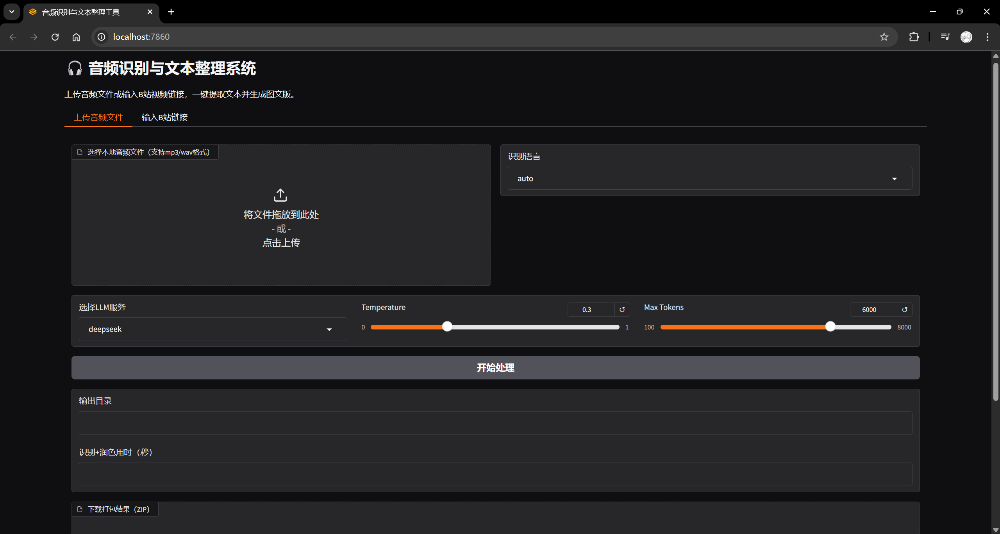
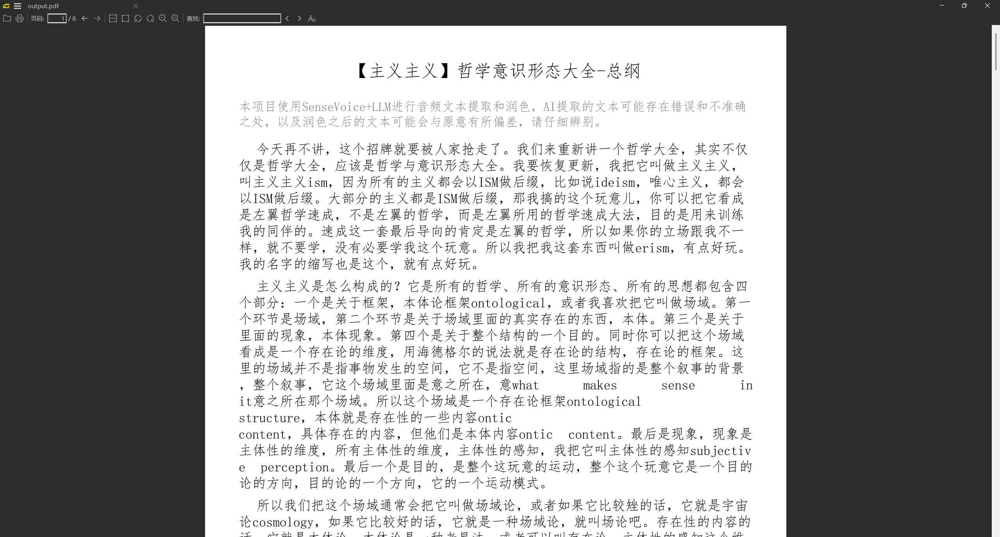

# AutoVoiceCollation

## 介绍

AutoVoiceCollation是一个自动语音识别（ASR）和文本处理工具，旨在帮助用户快速整理和润色语音转录文本。支持：

- 使用SenseVoiceSmall或者paraformer完成语音转文本
- b站视频语音识别
- 本地音频文件语音识别
- LLM自动润色（目前支持deepseek、qwen3与gemini）
- 自动导出文本文件、PDF或图片
- 一键生成字幕文件（.cc/.srt）并支持视频硬编码

## Quick Start

* 克隆代码

```bash
git clone https://github.com/LogicShao/AutoVoiceCollation
cd AutoVoiceCollation
```

* 创建虚拟环境

```bash
python -m venv .venv
```

* 激活虚拟环境

Windows:

```bash
.venv\Scripts\activate
```

Linux:

```bash
source .venv/bin/activate
```

* 安装依赖

```bash
pip install -r requirements.txt
```

* 运行

```bash
python main.py # 命令行调用
# python webui.py # web调用
# python -m src.get_timestamp # 获取字幕文件
```

## Demo 展示

webui demo:


pdf output demo:


## 配置

- `config.py`：配置文件，包含了模型选择等参数。
- `.env`：配置文件，位于项目根目录下，请配置你的api密钥，或者直接设置环境变量。文件类似于：

```dotenv
DEEPSEEK_API_KEY=your_deepseek_api_key
GEMINI_API_KEY=your_gemini_api_key
DASHSCOPE_API_KEY=your_dashscope_api_key
```
