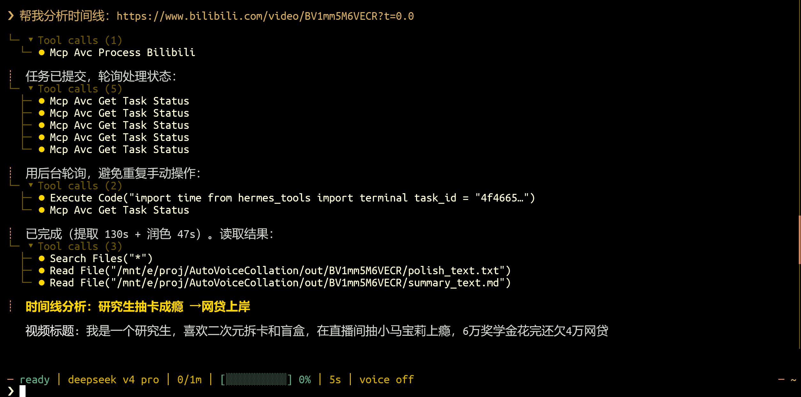
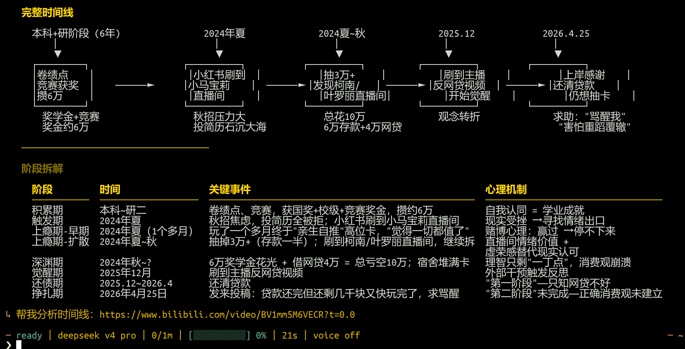
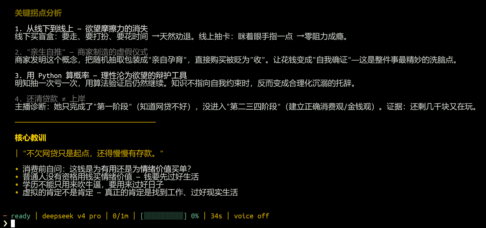

# AutoVoiceCollation

<div align="center">
  
</div>

AutoVoiceCollation 是一个面向中文场景的音视频转文本工具，集成 ASR（Paraformer / SenseVoice / whisper.cpp）与 LLM 文本处理能力，支持 CLI、Web、REST API、**MCP（Model Context Protocol）** 四种使用方式。

## MCP — AI Agent 原生接入

> AutoVoiceCollation 现已支持 MCP，让 Claude Desktop、Cursor、Hermes 等 AI Agent 直接调用音视频转写能力，
> 无需离开对话界面即可完成"搜索 B 站视频 → 转写分析 → 生成思维导图"的全流程。

| 能力 | 说明 |
|---|---|
| **B 站搜索** | Agent 直接搜索 B 站视频，无需浏览器 |
| **一键分析** | 提交视频 → 自动转写 + LLM 结构化分析（摘要/关键点/分段） |
| **文本交付** | Agent 直接获取转写原文、润色稿、摘要 —— 无需下载文件 |
| **思维导图** | 基于转写内容自动生成 Mermaid 思维导图 |
| **批量处理** | 一次性提交多个视频 URL，异步排队处理 |

### 快速体验（1 分钟）

**1. 启动 API 服务**

```bash
python api.py
```

**2. 配置你的 AI Agent**

以 **Claude Desktop** 为例，编辑 `claude_desktop_config.json`：

```json
{
  "mcpServers": {
    "avc": {
      "command": "python",
      "args": ["-m", "src.mcp.server"],
      "cwd": "/path/to/AutoVoiceCollation"
    }
  }
}
```

以 **Cursor** 为例，编辑 `~/.cursor/mcp.json`：

```json
{
  "mcpServers": {
    "avc": {
      "command": "python",
      "args": ["-m", "src.mcp.server"],
      "cwd": "/path/to/AutoVoiceCollation"
    }
  }
}
```

以 **Hermes Agent** 为例，在 `config.yaml` 中添加：

```yaml
mcp_servers:
  avc:
    command: python
    cwd: /path/to/AutoVoiceCollation
    args:
      - -m
      - src.mcp.server
    enabled: true
```

### Hermes Agent 演示







**3. 开始对话** —— 重启 AI Agent 后即可使用（会自动发现 8 个 MCP 工具和 5 个资源）。

> **WSL2 用户注意**：如果在 WSL2 中通过 stdio 调用 Windows Conda Python，请阅读 [WSL2 + Conda MCP 配置避坑指南](docs/development/wsl2-conda-mcp.md)。

### MCP 工具列表

| 工具名 | 功能 | 关键参数 |
|---|---|---|
| `process_bilibili` | 处理 B 站视频 | `url`, `summarize`, `output_style`, `prompt_hint` |
| `process_audio` | 处理本地音/视频文件 | `file_path`, `summarize`, `output_style`, `prompt_hint` |
| `process_batch` | 批量处理多个 B 站 URL | `urls` (list), `summarize` |
| `get_task_status` | 查询任务状态与文本结果 | `task_id` |
| `cancel_task` | 取消进行中的任务 | `task_id` |
| `analyze_video` | 一键分析：转写 + LLM 结构化 | `url`, `prompt_hint` |
| `search_bilibili` | 搜索 B 站视频 | `keyword`, `max_results` |
| `generate_mindmap` | 为已完成任务生成思维导图 | `task_id`, `prompt_hint` |

### MCP 资源（Agent 直读，无需下载文件）

| 资源 URI | 内容 |
|---|---|
| `avc://task/{task_id}/transcript` | 原始转写全文 |
| `avc://task/{task_id}/polished` | LLM 润色后文本 |
| `avc://task/{task_id}/summary` | 摘要 |
| `avc://task/{task_id}/mindmap` | 思维导图 JSON 结构 |
| `avc://task/{task_id}/analysis` | 结构化分析（关键点 + 分段） |

### 演示 Prompt 示例

> 以下 prompt 可用于截屏演示，展示 AI Agent 如何通过 MCP 与 AutoVoiceCollation 交互。

**场景 1：搜索 + 分析 B 站视频**

```
帮我搜索 B 站上关于 "大语言模型微调" 的视频，找播放量最高的 3 个，然后分析第一个视频的内容
```

**场景 2：一键深度分析**

```
帮我分析这个 B 站视频 https://www.bilibili.com/video/BV1xx411c7mD，提取关键观点和章节分段
```

**场景 3：本地音频转写 + 润色**

```
帮我把 /home/user/meeting.mp3 转写成文字，然后润色一下，最后用思维导图总结
```

**场景 4：批量处理 + 摘要**

```
帮我把这些 B 站视频都处理一遍，每个都生成摘要：
- https://www.bilibili.com/video/BV1xx411c7mD
- https://www.bilibili.com/video/BV1xx411c7mE
```

**场景 5：思维导图生成**

```
任务 abc123 已经完成了，帮我为它的转写内容生成思维导图
```

**场景 6：搜索 + 资讯聚合**

```
搜索 B 站上最近关于 "AI Agent" 的热门视频，列出播放量前 5 的
```

## 核心能力

- 多输入源：B站链接、本地音频、本地视频
- 多 ASR 方案：`paraformer`、`sense_voice`、`whisper_cpp`
- 多 LLM 提供商：DeepSeek / Gemini / Qwen / Cerebras / 本地模型
- 多输出形态：`pdf_only`、`pdf_with_img`、`img_only`、`markdown`、`json`、`text_only`
- 异步任务队列：提交任务后立即返回 `task_id`，通过轮询获取结果
- **MCP 协议**：AI Agent 原生接入，8 个工具 + 5 个资源，支持 Claude Desktop / Cursor / Hermes

## 快速开始

### 方式一：Docker（推荐）

1) 准备配置文件

```bash
git clone https://github.com/LogicShao/AutoVoiceCollation
cd AutoVoiceCollation
cp .env.example .env
```

2) 启动服务

```bash
# Linux / Mac
bash "scripts/docker-start.sh" start

# Windows (PowerShell / CMD)
& "scripts/docker-start.bat" start
```

3) 访问服务

- Web/API: `http://localhost:8000`
- OpenAPI: `http://localhost:8000/docs`

### 方式二：本地运行

1) Python 环境 + 前端依赖

```bash
python -m venv venv
# Windows
venv\Scripts\activate
# Linux / Mac
source venv/bin/activate
pip install -r requirements.txt

# 前端（Tailwind CSS）
npm install
npm run build
```

2) 配置环境变量

```bash
# Linux / Mac
cp .env.example .env
# Windows
copy .env.example .env
```

3) 启动

```bash
# 启动 API + Web
python "api.py"

# CLI（交互模式）
python "main.py"
```

## 使用方式

### CLI

```bash
# 单任务：本地音频
python "main.py" single --audio "/path/to/audio.mp3"

# 单任务：本地视频
python "main.py" single --video "/path/to/video.mp4"

# 单任务：B站链接
python "main.py" single --bili "https://www.bilibili.com/video/BV..."

# 批量任务（文本文件每行一个 URL）
python "main.py" batch --url_file "urls.txt"

# 字幕生成
python "main.py" subtitle --video "/path/to/video.mp4"
```

### API

```bash
python "api.py"
```

主要端点：

- `POST /api/v1/process/bilibili`
- `POST /api/v1/bilibili/check-multipart`
- `POST /api/v1/process/multipart`
- `POST /api/v1/process/audio`
- `POST /api/v1/process/batch`
- `POST /api/v1/process/subtitle`
- `POST /api/v1/summarize`
- `GET /api/v1/task/{task_id}`
- `GET /api/v1/tasks`
- `POST /api/v1/task/{task_id}/cancel`
- `GET /api/v1/download/{task_id}`

完整示例见 `docs/user-guide/api-usage.md`。

## 关键配置（`.env`）

```bash
# ASR
ASR_MODEL=paraformer          # paraformer / sense_voice / whisper_cpp
DEVICE=auto                   # auto / cpu / cuda / cuda:0 ...
USE_ONNX=false

# LLM
LLM_SERVER=Cerebras:Qwen-3-235B-Instruct
LLM_TEMPERATURE=0.1
LLM_MAX_TOKENS=6000

# 输出
OUTPUT_STYLE=pdf_only         # pdf_with_img / img_only / text_only / pdf_only / markdown / json / mindmap
ZIP_OUTPUT_ENABLED=false

# 功能开关
DISABLE_LLM_POLISH=false
DISABLE_LLM_SUMMARY=false
```

### 支持的 LLM 模型

| 模型标识 | Provider | API Key 字段 |
|---|---|---|
| `deepseek-chat` | DeepSeek | `DEEPSEEK_API_KEY` |
| `deepseek-reasoner` | DeepSeek | `DEEPSEEK_API_KEY` |
| `deepseek-v4-pro` | DeepSeek | `DEEPSEEK_API_KEY` |
| `deepseek-v4-flash` | DeepSeek | `DEEPSEEK_API_KEY` |
| `gemini-2.0-flash` | Google Gemini | `GEMINI_API_KEY` |
| `qwen3-plus` | DashScope (阿里云) | `DASHSCOPE_API_KEY` |
| `qwen3-max` | DashScope (阿里云) | `DASHSCOPE_API_KEY` |
| `Cerebras:Qwen-3-32B` | Cerebras | `CEREBRAS_API_KEY` |
| `Cerebras:Qwen-3-235B-Instruct` | Cerebras | `CEREBRAS_API_KEY` |
| `Cerebras:Qwen-3-235B-Thinking` | Cerebras | `CEREBRAS_API_KEY` |
| `local:Qwen/Qwen2.5-1.5B-Instruct` | 本地 | 需设置 `LOCAL_LLM_ENABLED=true` |

### Whisper.cpp 模型使用指南

whisper.cpp 是 OpenAI Whisper 的 C++ 移植版，无需 GPU、内存占用低、支持多平台。
适合不想安装 PyTorch 或模型文件过大（Paraformer ~2GB）的场景。

#### 1. 下载 whisper.cpp 可执行文件

```bash
# 方式 A：从 GitHub Releases 下载预编译版本
# https://github.com/ggerganov/whisper.cpp/releases
# 选择对应平台（Windows: whisper-cli.exe, Linux: whisper-cli, macOS: whisper-cli）

# 方式 B：自行编译
git clone https://github.com/ggerganov/whisper.cpp
cd whisper.cpp
cmake -B build && cmake --build build --config Release
# 编译产物在 build/bin/Release/whisper-cli.exe (Windows) 或 build/bin/whisper-cli (Linux)
```

将可执行文件放到项目 `assets/whisper.cpp/` 目录下（默认路径）。

#### 2. 下载 ggml 模型文件

```bash
# 推荐：medium 模型（1.5GB，中英文平衡，CPU 可运行）
wget https://huggingface.co/ggerganov/whisper.cpp/resolve/main/ggml-medium-q5_0.bin

# 其他可选模型（越大精度越高，速度越慢）：
# tiny     (78MB)   - 最快，精度最低
# base     (148MB)  - 快速基准
# small    (488MB)  - 速度与精度平衡
# medium   (1.5GB)  - 推荐，中英文优秀
# large-v3 (3.1GB)  - 最高精度，较慢
```

将模型文件放到 `assets/models/` 目录下（默认路径）。

#### 3. 配置 `.env`

```bash
# 切换 ASR 模型
ASR_MODEL=whisper_cpp

# whisper.cpp 可执行文件路径（留空使用默认：./assets/whisper.cpp/whisper-cli.exe）
WHISPER_CPP_BIN=./assets/whisper.cpp/whisper-cli

# ggml 模型文件路径（留空使用默认：./assets/models/ggml-medium-q5_0.bin）
WHISPER_CPP_MODEL=./assets/models/ggml-medium-q5_0.bin

# 语言（auto 自动检测；zh 强制中文；en 强制英文）
WHISPER_CPP_LANGUAGE=auto

# CPU 线程数（建议设为物理核心数）
WHISPER_CPP_THREADS=4

# 额外参数（原样传给 whisper-cli）
WHISPER_CPP_EXTRA_ARGS=--no-gpu

# VAD（语音活动检测，跳过静音段提升精度，可选）
# WHISPER_CPP_VAD=true
# WHISPER_CPP_VAD_MODEL=./assets/models/ggml-silero-v6.2.0.bin
```

#### 4. 使用

配置完成后正常使用即可，与 paraformer/sense_voice 用法完全一致：

```bash
# CLI
python main.py single --audio "/path/to/audio.mp3"

# API
curl -X POST http://localhost:8000/api/v1/process/audio \
  -F "file=@audio.mp3"
```

#### 5. 性能对比

| 模型 | 大小 | 中文精度 | 速度（CPU, 4线程, 1分钟音频） | 适用场景 |
|---|---|---|---|---|
| `ggml-tiny-q5_0` | 78MB | ★★☆ | ~10s | 实时/快速预览 |
| `ggml-small-q5_0` | 488MB | ★★★ | ~30s | 资源受限设备 |
| `ggml-medium-q5_0` | 1.5GB | ★★★★ | ~60s | **推荐，日常使用** |
| `ggml-large-v3-q5_0` | 3.1GB | ★★★★★ | ~120s | 高精度离线处理 |

## 文档（MVP）

- 文档入口：`docs/README.md`
- MCP 配置：`docs/development/wsl2-conda-mcp.md`（WSL2 + Conda 避坑指南）
- Docker 部署：`docs/deployment/docker.md`
- API 使用：`docs/user-guide/api-usage.md`
- 开发指南：`docs/development/developer-guide.md`

## 项目结构（简版）

```text
AutoVoiceCollation/
├── api.py
├── main.py
├── src/
│   ├── api/
│   ├── core/
│   ├── mcp/                 # MCP Server（8 Tools + 5 Resources）
│   ├── services/
│   ├── text_arrangement/
│   └── utils/
├── frontend/
├── tests/
└── docs/
```

## 开发与测试

```bash
pip install -r requirements-test.txt
pytest
ruff check .
ruff format .
```

## 许可证

MIT License
